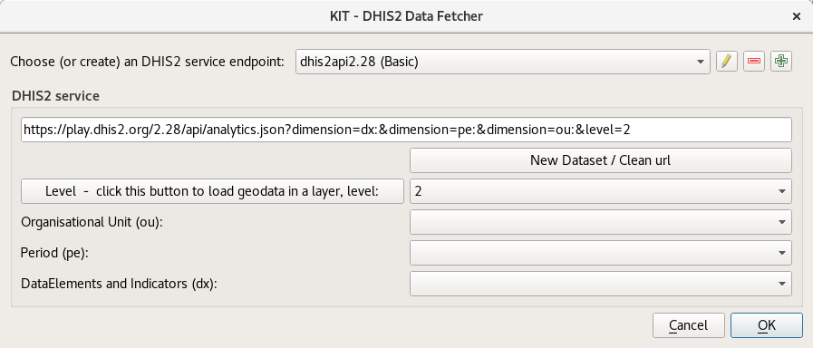
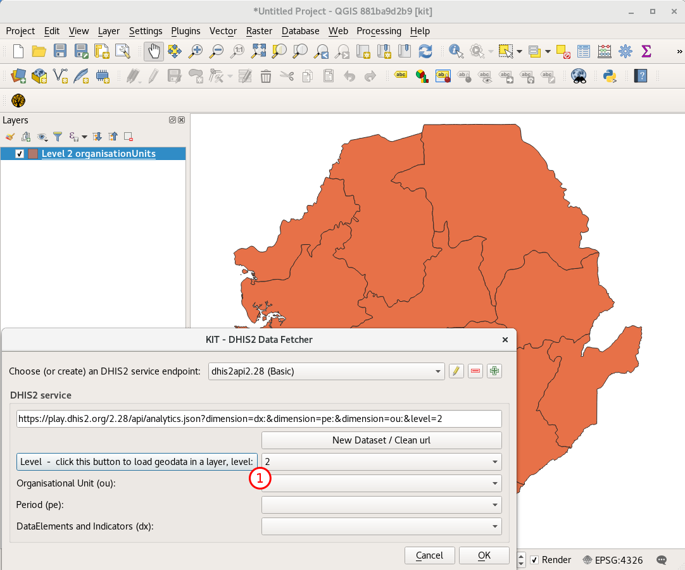

KIT - DHIS2 Data Fetcher Plugin
===============================

Introduction
------------

This plugin makes it possible to 'talk' to the play.dhis2.org demo server with QGIS

In that way one can retrieve Geodata (Polygons and Points) AND the actual tabular data.

By 'joining' the Geodata and the Tabular data on (organisationalUnit-id) one combines two layers.

Saving a project also saves the url's which were used to retrieve the data. So by loading a saved project,
fresh data will be retrieved from the server and shown in saved style/configurations.

Before use
----------

Install QGIS
............

Make sure you have installed QGIS-3 (!) This plugin will only work in QGIS 3.x (not in the 2.18 LTR version!)

Download plugin
...............

Download the latest packaged plugin zip from the repo directory on https://github.com/rduivenvoorde/kit_dhis2_data_fetcher/repo

Install plugin
..............

Install the plugin in QGIS. You can do that via the Plugin Manager on the Install from ZIP-tab

Create Authentication
.....................

The REST api of https://play.dhis2.org needs Basic Authentication (admin/district). So first create the valid
(named dhis2ap) authentication configuration.

In the Settings / Options dialog select the Authentication tab.

If this is the first time you do this you will probably be asked to give an 'master password' (can be saved)

Then create a new 'Authentication' by clicking the green plus sign (1).

Fill in the details, most important is you use 'dhis2ap' as 'id' of this configuration (2).
AND the Username and Password for the demo site.

After that click Save (3) to save it on disk.

Now the plugin will use the 'dhis2ap' authentication credentials to authenticate itself at the dhis2 service.

First use
---------

If the plugins is succesfully installed you should see a 'KIT' button in your menubars (1).

And an extra menu item in your Plugins menu named 'KIT - DHIS2 Data Fetcher' (2).

If you added your credentials, upon clicking on the button, an dialog will be shown (empty, but dropdowns will
be filled dynamic by pulling the information from the server:

To retrieve Geodata (geojson), click on the button 'Level - click this button to load geodata in a layer, level:'.

Start with level 2.

You should see something like:

Then select an Organisational Unit (Level 2), select 'ALL'

Then select a Period (start with LAST_YEAR)

Then select a DataElement or an Indicator. Let's start with: 'Births total'.

You should see something like:

As you can see (1) by choosing values in the dropdowns, you add or remove items from the REST data url.

To start over, just click the 'New Dataset / Clean url' button (2).

Now click the OK button in the dialog.

The plugin will request json data from the server, parse it and present it to you in a table-layer named 'DHIS2 data' (1)
(in GIS terms: a table without geometry).

By clicking the little spreadsheet button in the toolbars (2) or selecting 'Open Attribute Table' in the context menu
of the layer you will open the 'attribute table' (3) of the layer, and you will see the data retrieved in tabular form.

Join
----

Now we have 2 separate data set: the level 2 districts as polygons, and the birth data per level 2 district as a table.

By 'joining' those two 'tables' they will be virtually 'merged', and you can use the birth data to style/color the districts.

To do this: double click the polygon layer, or select 'Properties' from the context menu.

In the Layer properties dialog select the 'Joins' tab. You should see:

Now Create a new Join by selecting the green plus and choose 'DHIS2 data' as Join layer and twice 'id' as Join field
and Target field. Then OK.

Looking into the Attribute data now of the Level 2 organisationUnits, reveals 2 new columns (1) which come
from the DHIS2 data:

.. image:: images/join3.png

Now that data can be used to change the symbology of the map, by for example use a simple Graduated style of 3 Classes:

The End
-------

Now you should be able to retrieve data from demo.dhis2.org and combine it with either the geodata from there.
BUT you can also use your own geodata to create joins (IF you use the same Foreign keys).

Save the project as 'myfirstmap.qgs' somewhere on disk.

No close the project and reopen it. The plugin should retrieve both the data and geodata freshly from the server,
make the joins you did earlier and use the saved symbology.

The actual example is in the docs directory saved (example_project.qgs) on github and can be downloaded too to be opened:

